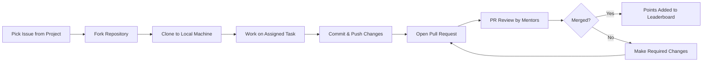

Here’s the **complete Markdown** for your GSSoC Contribution Guidelines — fully ready to copy and paste into a `CONTRIBUTING.md` file or README.

<h1 align="center">🌸 GirlScript Summer of Code – Contribution Guidelines</h1>

<p align="center">
<a href="https://gssoc.girlscript.tech/">
  
</a>
</p>

<p align="center">
  
  
  <a href="https://github.com/GirlScriptSummerOfCode"></a>
  <a href="https://gssoc.girlscript.tech/"></a>
</p>

---

# 📜 Contribution Guidelines

Welcome to **GirlScript Summer of Code (GSSoC)**!  
This guide explains how to contribute effectively and how the **point system** works.

---

## 🚀 How to Contribute

1. **🔍 Find a Project**
   - Browse the list of participating repositories on the [GSSoC Projects Page](https://gssoc.girlscript.tech/projects).
   - Read the project’s README and explore open issues.

2. **🎯 Pick an Issue**
   - Look for labels like `GSSoC`, `good first issue`, or `help wanted`.
   - Ask the mentor/maintainer to **assign** the issue to you before starting.

3. **🔧 Fork & Clone**
   ```bash
   git fork <repo-url>
   git clone <your-fork-url>
   
   ```

* Set up the project as described in its documentation.

4. **💻 Work on the Issue**

   * Follow the coding style, naming conventions, and guidelines.
   * Keep commits clean and meaningful.

5. **📬 Create a Pull Request (PR)**

   * Push your changes to your fork.
   * Open a PR against the correct branch (`main` or `dev` as per project rules).
   * Clearly describe your changes and link the issue.

6. **📝 Review & Merge**

   * Mentors review your PR and assign a **level** (L1, L2, L3).
   * Once merged, your points will be updated automatically on the leaderboard.

---

## 🏆 Points System

| **Level**   | **Description**                    | **Points** |
| ----------- | ---------------------------------- | ---------- |
| **L3**      | Small fix (typos, minor docs)      | 5          |
| **L2**      | Medium feature or moderate changes | 10         |
| **L1**      | Large feature, major refactor      | 15         |
| **Invalid** | Spam or irrelevant PR              | -5         |

> 📌 **Note:** Points are awarded only for **merged** PRs.

---

## ⚠️ Rules to Remember

* 🚫 No splitting one big task into many small PRs for extra points.
* ✅ Always follow the [Code of Conduct](https://gssoc.girlscript.tech/code-of-conduct).
* 💬 Communicate clearly with mentors for assignments.
* 🕒 Points may take up to **24 hours** to appear on the leaderboard.

---

## 📊 Track Your Progress

* Check the **[Leaderboard](https://gssoc.girlscript.tech/leaderboard)** to see your rank.
* Work consistently to climb the leaderboard.

---

## 📈 Contribution Flow



---

💡 *Happy contributing & keep the open-source spirit alive!* 🚀

```

This is **fully copy-paste ready** — it will display the banner, badges, sections, and Mermaid flowchart directly on GitHub.  

Do you want me to make the Mermaid diagram **colorful** so it’s visually appealing in GitHub’s dark mode? That would make it pop more.
```

