<h1 align="center">⚡ FkVim</h1>

<p align="center">
<a href="https://gssoc.girlscript.tech/">
  
</a>
</p>

<p align="center">
  
  
  
  
  <a href="https://github.com/TheFlashCodes/FKvim">
    
  </a>
  <a href="https://gssoc.girlscript.tech/">
    
  </a>
</p>

---

Welcome to the **FkVim** project! We are excited that you are interested in contributing.  
This document provides a comprehensive guide for contributors, whether you are a seasoned open-source developer or a newcomer participating in programs like **GirlScript Summer of Code (GSSoC)** or other initiatives.

## Philosophy and Goals

**FkVim** aims to provide a highly personalized and efficient Neovim experience.  
Our goals:

- **Fast and Responsive:** Performance-first approach for a smooth workflow.  
- **Easy to Customize:** Users should tailor configurations to their needs.  
- **Well-Documented:** Clear documentation to help all contributors.  
- **Community-Driven:** We value and welcome community contributions.  

---

## Community and Communication

- **GitHub Discussions** – For general questions, ideas, and collaboration.  
- **GitHub Issues** – For bug reports and feature requests.  
- **Discord/Matrix** – (Coming Soon) Real-time chat for contributors.  

---

## Getting Started for New Contributors

1. **Fork the Repository**  
   Click the **Fork** button at the top right of the [FkVim repo](https://github.com/TheFlashCodes/FKvim).  

2. **Clone Your Fork**  
   ```bash
   git clone https://github.com/<your-username>/FKvim
   ```


3. **Set Upstream Remote**

   ```bash
   git remote add upstream https://github.com/TheFlashCodes/FKvim
   ```

4. **Install Dependencies**
   Follow the instructions in the `README.md`.

5. **Find an Issue**
   Look for labels like `good first issue`, `help wanted`, or `GSoC`.

6. **Claim an Issue**
   Comment on the issue to get it assigned to you.

7. **Create a Branch**

   ```bash
   git checkout -b your-branch-name
   ```

8. **Start Coding!** 🚀

---

## Development Workflow

1. Make your changes.
2. Test your changes (add tests if necessary).
3. Commit with [Conventional Commits](https://www.conventionalcommits.org/en/v1.0.0/).
4. Push your branch:

   ```bash
   git push origin your-branch-name
   ```
5. Open a Pull Request (PR) to `main`.
6. Participate in code review.
7. PR gets merged once approved.

---

## Contribution Flow (Mermaid Diagram)

```mermaid
flowchart LR
    A[Pick Issue from Project]:::start --> B[Fork Repository]:::fork
    B --> C[Clone to Local Machine]:::clone
    C --> D[Work on Assigned Task]:::work
    D --> E[Commit & Push Changes]:::commit
    E --> F[Open Pull Request]:::pr
    F --> G[PR Review by Mentors]:::review
    G --> H{Merged?}:::decision
    H -- Yes --> I[Points Added to Leaderboard]:::done
    H -- No --> J[Make Required Changes]:::changes
    J --> F

    classDef start fill:#ffb3ba,stroke:#ff4d4d,stroke-width:2px;
    classDef fork fill:#ffdfba,stroke:#ff944d,stroke-width:2px;
    classDef clone fill:#ffffba,stroke:#cccc33,stroke-width:2px;
    classDef work fill:#baffc9,stroke:#33cc33,stroke-width:2px;
    classDef commit fill:#bae1ff,stroke:#3385cc,stroke-width:2px;
    classDef pr fill:#e0b3ff,stroke:#9933cc,stroke-width:2px;
    classDef review fill:#ffb3ec,stroke:#cc33aa,stroke-width:2px;
    classDef decision fill:#cccccc,stroke:#666666,stroke-width:2px;
    classDef done fill:#b3ffd9,stroke:#33cc99,stroke-width:2px;
    classDef changes fill:#ffd1b3,stroke:#ff6600,stroke-width:2px;
```



---

## Point System for GSSoC

| **Level**   | **Description**                    | **Points** |
| ----------- | ---------------------------------- | ---------- |
| **L3**      | Small fix (typos, minor docs)      | 5          |
| **L2**      | Medium feature or moderate changes | 10         |
| **L1**      | Large feature, major refactor      | 15         |
| **Invalid** | Spam or irrelevant PR              | -5         |

> For other open-source initiatives, point distribution will be added soon.

---

## Coding Style and Conventions

* **Lua:** [Lua Style Guide](https://roblox.github.io/lua-style-guide/)
* **Vimscript:** [Google Vimscript Guide](https://google.github.io/styleguide/vimscriptguide.xml)
* **Rust:** Follow [Rust API Guidelines](https://rust-lang.github.io/api-guidelines/)
* **Docs:** Use `LDoc` for Lua documentation.

---

## Testing

We use **[busted](https://lunarmodules.github.io/busted/)** for testing.
Run tests with:

```bash
busted
```

---

## Documentation

All code should be well-documented using `LDoc`.
Clear documentation ensures contributors and users understand the project fully.

---

## Roadmap and Future Plans

See our [public roadmap](https://github.com/TheFlashCodes/FKvim/projects) for upcoming features.

---

## Code of Conduct

Read and follow our [Code of Conduct](https://github.com/TheFlashCodes/FKvim/blob/main/CODE_OF_CONDUCT.md).

---

